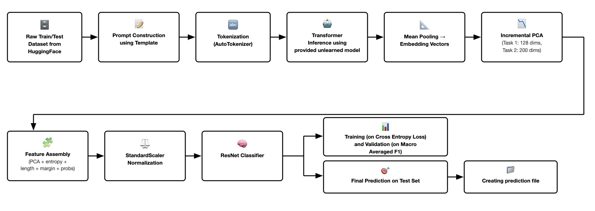

# priyam_saha17 at SVELA: A Feature-Centric Pipeline for Verifying Selective Forgetting in Large Language Models

### Author: Priyam Saha 
### Kaggle Public Notebooks: 
#### Task 1: [Link](https://www.kaggle.com/code/priyamsaha17/svela-task-1)
#### Task 2: [Link](https://www.kaggle.com/code/priyamsaha17/svela-task-2)

### Abstract: 
This paper presents the system developed by team priyam_saha17 for the SVELA (Selective Verification of Erasure from LLM Answers)1 shared task at EVALITA (Evaluation of NLP and Speech Tools for Italian) 2026. SVELA addresses the problem of verifying whether a large language model has selectively forgotten specific information while retaining relevant knowledge. The problem statement is: given a large language model that has been fine-tuned and subsequently unlearned on a hidden subset of identities, determine whether a specific identity–topic pair has been retained, forgotten, or never seen during training. Rather than modifying or probing internal model parameters, the approach focuses on analyzing observable behavioral signals produced by the language models, which have been subjected to certain specific unlearning algorithms by track organisers. On the official leaderboards, the system ranked first in all four tracks. For Task 1, mean scores of 0.3428 (1B param models) and 0.3565 (3B param models) were achieved, while for Task 2 the system obtained mean scores of 0.3345 (1B param models) and 0.3335 (3B param models). In contrast, the organizers reported baseline mean scores of 0.2813 (1B-parameter models) and 0.2855 (3B-parameter models) for Task 1, and 0.265 (1B-parameter models) and 0.2706 (3B-parameter models) for Task 2. These results indicate that feature-centric analysis of model behavior provides a robust signal for selective forgetting verification across tasks and model scales.

#### Flowchart illustrating the complete pipeline of the proposed system:

### SVELA Website:
The SVELA homepage can be accessed here: [SVELA Link](https://svela-task.github.io/index.html)

### Final evaluation:
On the official leaderboards, the system ranked first in all four tracks. For Task 1, mean scores of 0.3428 (1B param models) and 0.3565 (3B param models) were achieved, while for Task 2 the system obtained mean scores of 0.3345 (1B param models) and 0.3335 (3B param models) 

The SVELA Leaderboard can be accessed here: [Leaderboard Link](https://docs.google.com/spreadsheets/d/1ULbyEjIWBwhoIa1AcW9ZRFGWX9fcmavy/edit?gid=1110249838#gid=1110249838)
